# Supervised Machine Learning: Regression - Module 1

## 1. Introduction to Supervised Machine Learning

### What is Machine Learning?

**Core Definition**: Machine learning allows computers to learn from data.

**Key Distinction from Traditional Statistical Modeling**:
- **Traditional**: We know about the underlying process → choose model that approximates it → develop predictive model
- **Machine Learning**: We know less about underlying process OR it's too complicated → learn/approximate the equation from data → function approximation enables future predictions

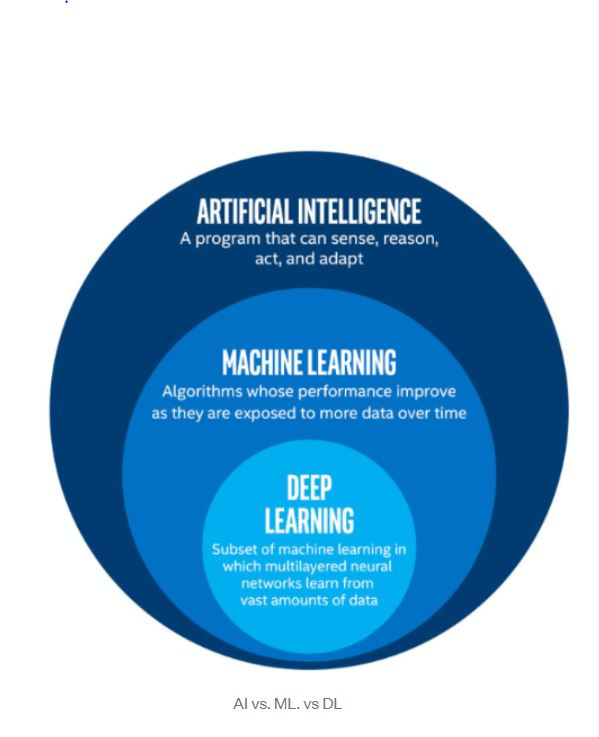

### Machine Learning in the AI Framework

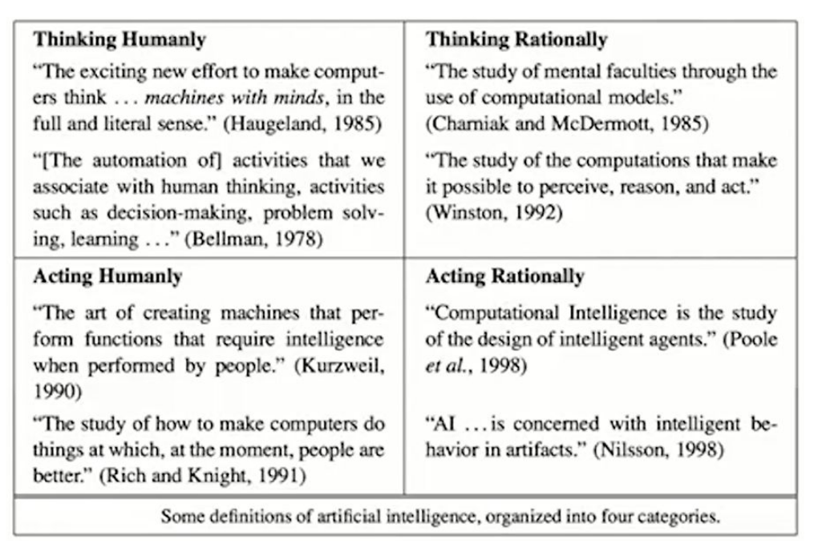

**Artificial Intelligence Categories** (Russell & Norvig):
- Four quadrants based on:
  - **Rows**: Thinking vs Acting
  - **Columns**: Human behavior vs Rational behavior
- ML focuses on **thought processes** (top row)
- Application determines focus:
  - Marketing → human reactions (humanly)
  - Supply chain → rational optimization (rationally)

**Machine Learning's Core**: LEARNING
- Root capability enabling: decisions, problem-solving, perceiving, reasoning, acting
- ML = subset of AI where machines are able to learn

### What is a Model?

**Definition**: A small thing that captures a larger thing

**Good Model Characteristics**:
- Omits unimportant details
- Retains important features
- Preserves key relationships
- Reduces real-world complexity for understanding

**Example**: Map (model) vs Territory (reality)
- Shows country borders and water bodies (important)
- Omits city boundaries and landmarks (less important for this purpose)


### Daily Life ML Applications
- Spam filtering (classify emails)
- Web search (ranking websites)
- Route optimization (mail delivery)
- Fraud detection
- Movie recommendations

---

## 2. The Machine Learning Framework

### Core Machine Learning Equation

**The Fundamental Framework**:
```
Ŷ = f(Ω, X)
```

Where:
- **Ŷ** (Y_predicted): Predicted output value
- **X**: Input features/data
- **Ω** (Omega): Parameters learned by the model
- **f**: The machine learning model/function

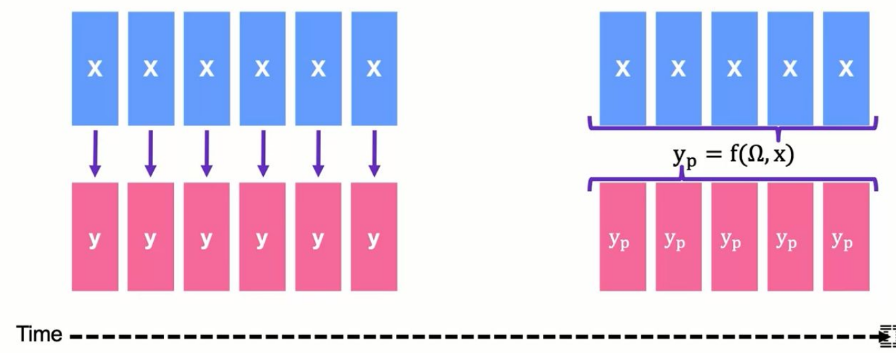

### Parameters vs Hyperparameters

**Fit Parameters**:
- Aspects estimated using data
- Example: Linear regression coefficients
- Learned during the "fit" process

**Hyperparameters**:
- Decisions made BEFORE fitting to data
- Decisions about the model itself
- Not directly learned by model
- Used to tweak/optimize model power

### Learning Process

**How Parameters are Learned**:
1. Train model on past data
2. Each observation X relates to outcome Y
3. More data → better parameter learning
4. Parameters define X-Y relationship

**Example - Customer Churn**:
- Train on past customers
- Learn parameters from training set
- Apply to new customers
- Generate predictions Ŷ for each new customer

### The Loss Function

**Loss Function Definition**:
```
J(Y, Ŷ)
```
- **J**: Loss/cost function
- **Y**: Actual values
- **Ŷ**: Predicted values
- **Output**: Quantitative measure of prediction quality

**Update Rule**:
- Determines how to update parameters
- Goal: Minimize loss function
- Minimize error between Y and Ŷ

### Overfitting Prevention

**Problem**: Complex models can learn overly specific patterns
- Example: "Customer with 3 months membership, $30/month subscription, named Daniel Mandel will churn"

**Solution**: Train/Test Split
- Train on subset of data
- Optimize on holdout set (not seen during training)
- Test real-world performance before production

### Two Types of Supervised Learning

**1. Regression**:
- Predicting **numeric values**
- Examples:
  - Stock price
  - Box office revenue
  - Location (X,Y coordinates)

**2. Classification**:
- Predicting **categorical outcomes**
- Examples:
  - Face recognition (which person)
  - Customer churn (yes/no)
  - Next word prediction

---

## 3. Machine Learning Objectives: Interpretation vs Prediction

### Interpretation as Primary Objective

**Goal**: Understanding the mechanism of the model

**Focus**: Parameters provide insights about data
- Which features are most important?
- How do features affect outcomes?
- Understanding underlying differences

**Workflow**:
1. Gather X and Y data
2. Train model to learn best parameters (minimize loss)
3. Focus on parameters themselves (not just predictions)
4. May choose less complex model for higher interpretability

**Examples**:
- **Customer demographics vs sales**: Care about loyalty by segments (what drives sales) rather than predicting future sales
- **Safety features preventing accidents**: How to adjust features to prevent accidents rather than predicting accident counts
- **Marketing budget effect on movie revenue**: Understanding effectiveness and optimal spending rather than predicting exact revenue

### Prediction as Primary Objective

**Goal**: Best possible predictions compared to actual values

**Focus**: Performance metrics
- Comparing Ŷ (predicted) to Y (actual)
- Quantitative closeness measures
- May result in "black box" models

**Examples**:
- **Customer churn prediction**: Correctly predicting likelihood matters more than understanding why
- **Default prediction**: Getting it right > understanding underlying factors
- **Future purchase prediction**: Accuracy > understanding factors

### The Trade-off

**Key Insight**: Often must balance interpretation and prediction
- Interpretation examples also want good prediction
- Prediction examples would benefit from interpretability
- Business objectives determine the balance

**Model Selection Impact**:
- High interpretability models (e.g., linear regression)
- High prediction models (e.g., deep learning)
- Choose based on business needs

### Housing Dataset Example

**Target Variable**: House price

**Features**: 
- House quality
- Location
- Number of floors
- Year built
- Crime rate (can have negative importance)

**For Interpretation Focus**:
- Look at feature importance graph
- Understand coefficients
- Learn what affects pricing
- Feature importance = absolute value of coefficient (positive or negative)

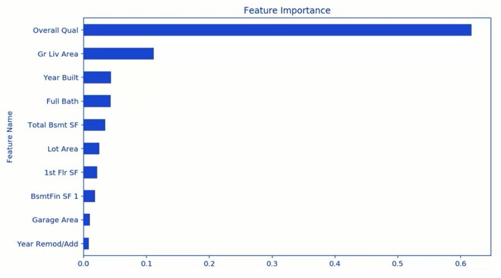

**For Prediction Focus**:
- Look at predicted vs actual values plot
- Points closer to diagonal = better predictions
- Focus on accuracy, not interpretability

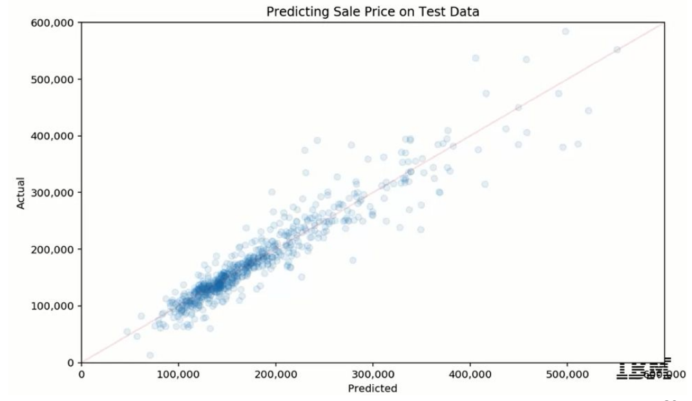

### Customer Churn Example

**Data**:
- Target: Customer left (yes/no)
- Features: Subscription cost, time as customer, etc.

**Dual Interest**:
- **Interpretation**: Understand factors leading to leaving
- **Prediction**: Estimate customer retention duration

### Key Takeaways on Trade-offs

1. Most projects need balance between interpretation and prediction
2. Interpretation can improve prediction (adjust/drop/combine features)
3. Better prediction increases confidence in feature importances
4. Not all models support both equally
5. Simple linear regression = highly interpretable
6. Deep learning = less interpretable, potentially better prediction

---

## 4. Types of Supervised Learning: Classification vs Regression

### Overview of Supervised Learning Process

**General Workflow**:
1. Start with data containing outcomes (labels/values)
2. Have a model (parameters not yet learned)
3. Fit model using data with outcomes
4. Learn parameters optimizing predictions
5. Apply fitted model to new unlabeled data
6. Generate predictions for new data

### Regression (Numeric Prediction)

**Definition**: Predicting continuous numeric outcomes

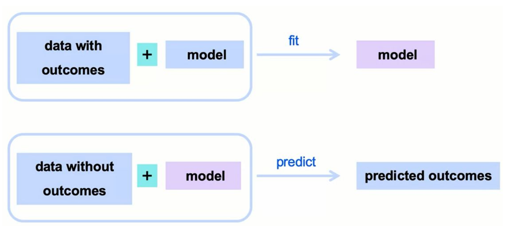

**Example - Movie Revenue Prediction**:
1. **Input**: Movie data with known revenue (marketing budget, cast budget, etc.)
2. **Model**: Unfit model with unlearned parameters
3. **Fitting**: Learn parameters to predict revenue from features
4. **Application**: Use fitted model on new movies with unknown revenue
5. **Output**: Predicted revenue values

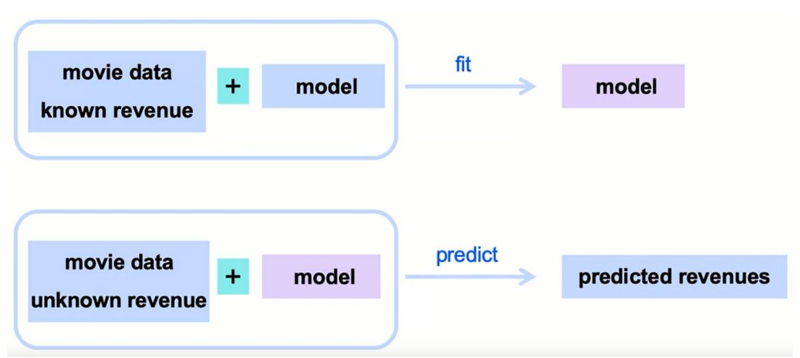

**Other Examples**:
- Box office revenue
- Housing prices
- Number of attendees
- Any continuous number

### Classification (Categorical Prediction)

**Definition**: Predicting categorical outcomes

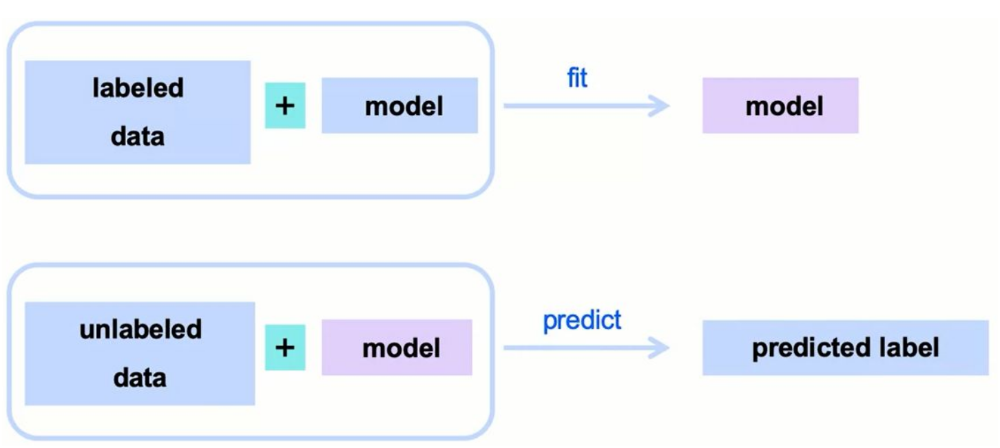

**Example - Spam Email Detection**:
1. **Input**: Emails labeled as spam/not spam
2. **Model**: Unfit model without parameters
3. **Fitting**: Learn which words indicate spam vs not spam
4. **Application**: Apply to unlabeled incoming emails
5. **Output**: Spam/not spam predictions → automatic folder sorting

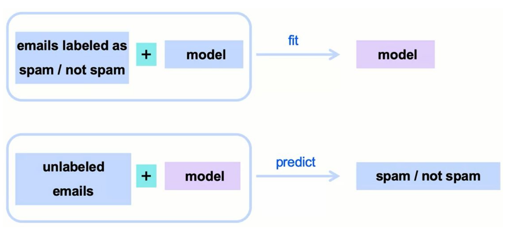

**How the Model Learns**:
- Analyzes word frequencies in spam vs legitimate emails
- Determines word importance for classification
- Fits parameters accordingly

**Other Examples**:
- Customer churn (yes/no)
- Fraudulent charge detection
- Political affiliation prediction

### Requirements for Classification

**1. Quantifiable Features**:
- Words in spam detection need encoding (e.g., one-hot encoding)
- All features must be numeric for processing

**2. Known Labels**:
- Need labeled dataset for training
- Human labeling often required (extra effort consideration)

**3. Similarity Metric**:
- Way to measure similarity between new and training records
- Compare word patterns in emails

### Key Framework Points

**Universal Application**:
- Framework applies to all business ML problems
- Always need: labeled data → fit model → predict new data

**The Fitting Process**:
- Use input features + outcome variables
- Optimize parameters
- Create fitted model for predictions

---

## 5. Linear Regression - Part 1

### Introduction to Linear Regression

**Example Problem**: Predict box office revenue using marketing budget

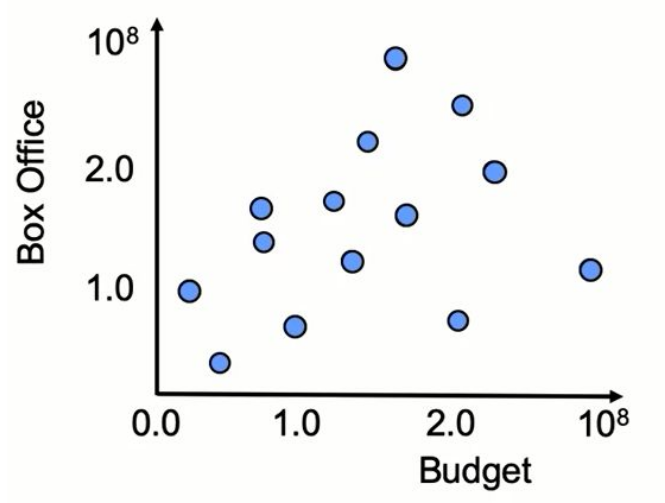

**Model Form**:
```
Ŷ(X) = β₀ + β₁X
```

Where:
- **Ŷ**: Predicted box office revenue
- **β₀** (beta naught): Y-intercept coefficient
  - Revenue when marketing budget = 0
  - Starting revenue with no marketing
- **β₁** (beta one): Slope coefficient
  - Revenue increase per dollar of marketing spend
  - How much Y increases when X increases by 1
- **X**: Marketing budget (single feature)

### Finding the Best Line

**Goal**: Find β₀ and β₁ that minimize the cost function J

**Process**:
1. Minimize distance between predictions and actual values
2. Best line = minimum total distance from all points
3. Line represents our predictions

**Example Values Found**:
- β₀ = 80 million (base revenue with $0 marketing)
- β₁ = 0.6 (60 cents revenue per marketing dollar)

**Making Predictions**:
- Marketing budget = $160 million
- Calculation: 80 + (0.6 × 160) = 176 million
- Predicted revenue: $176 million

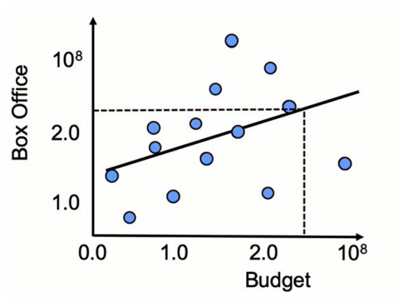

### Understanding Errors

**Error for Single Observation**:
```
Error = Ŷ(X) - Y_observed
```
- **Ŷ(X)**: Predicted value (point on line)
- **Y_observed**: Actual outcome (point on scatter plot)
- **Error**: Distance between prediction and actual (gray lines in visualization)

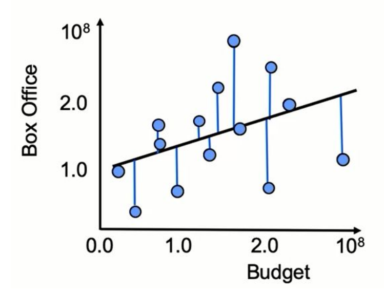

**Expanded Form**:
```
Error = (β₀ + β₁X) - Y_observed
```

### The Error Function

**Problem with Simple Error**:
- Can be negative or positive
- Errors might cancel out
- Need magnitude only

**Solutions**:

**L1 Norm (Absolute Value)**:
```
|Error| = |Ŷ(X) - Y_observed|
```

**L2 Norm (Euclidean Distance)** - Most Common:
```
Error² = (Ŷ(X) - Y_observed)²
```
- Gives actual distance length
- Always positive
- More commonly used

### Mean Squared Error (MSE)

**Formula**:
```
MSE = (1/m) × Σ(Ŷᵢ - Yᵢ)²
```

Where:
- **m**: Number of observations
- **Σ**: Sum over all observations
- **Ŷᵢ**: Predicted value for observation i
- **Yᵢ**: Actual value for observation i

**Interpretation**: 
- Average squared error across all observations
- Average length of prediction error lines
- Most popular cost function for linear regression

**Alternative Notation**:
```
MSE = (1/2m) × Σ(Ŷᵢ - Yᵢ)²
```
- Sometimes written with 1/2m instead of 1/m
- For computational convenience in calculus
- Minimizing either gives same result

**Key Points**:
- X and Y values are given (training data)
- MSE is function of β₀ and β₁
- We optimize β₀ and β₁ to minimize MSE
- This gives us the best fitting line

---

## 6. Linear Regression - Part 2

### Modeling Best Practices

**Three-Step Process**:

1. **Establish Cost Function**
   - Define what to minimize
   - Method to compare model strengths
   - Example: Mean Squared Error

2. **Develop Multiple Models**
   - Different hyperparameters
   - Different model types
   - Create variety for comparison

3. **Compare and Choose**
   - Evaluate using cost function
   - Select best performer
   - Make decision based on objective metrics

### R-Squared Metric

**Definition**: Measure of explained variation by model

**Components**:

**1. Sum of Squared Error (SSE)**:
```
SSE = Σ(Yᵢ - Ŷᵢ)²
```
- Unexplained variation from model
- Distance between truth and predictions
- What the model couldn't explain

**2. Total Sum of Squares (TSS)**:
```
TSS = Σ(Yᵢ - Ȳ)²
```
- Total variation in data
- Distance between truth and mean of Y
- Ȳ = average of all Y values
- Imagine horizontal line at mean

**3. R-Squared Formula**:
```
R² = 1 - (SSE/TSS)
```
- R² = 1 - (Unexplained Variance/Total Variance)
- R² = Explained Variation/Total Variation

**Interpretation**:
- Measures how well model explains variation from mean
- How much unexplained variance was reduced
- Closer to 1 = better explanation of variance
- Range: 0 to 1

### Important R-Squared Considerations

**Complexity Warning**:
- More complex models always fit data better
- Can fit perfectly to every point if desired
- Adding features never decreases R²

**Feature Addition Effect**:
- Non-predictive features won't hurt R²
- Model sets their coefficient to 0
- R² stays same or increases

**Universal Application**:
- Not limited to linear regression
- Usable for ANY regression model
- Measures explained variance for all regression types

### Python Implementation

**Step 1: Import the Class**
```python
from sklearn.linear_model import LinearRegression
```
- First introduction to scikit-learn (sklearn)
- Import regression method class

**Step 2: Create Model Instance**
```python
LR = LinearRegression()
```
- Creates algorithm object
- Model not yet fitted to data
- Just empty model structure

**Step 3: Fit the Model**
```python
LR.fit(X_train, y_train)
```
- Pass training data to model
- X_train: Input features
- y_train: Target values
- Optimizes to minimize loss function
- Calculates optimal coefficients

**Step 4: Make Predictions**
```python
y_pred = LR.predict(X_test)
```
- Use fitted model for predictions
- X_test: New data without labels
- Returns predicted values
- predict() method available after fitting

### Complete Code Example with Comments
```python
# Import the linear regression class from scikit-learn
from sklearn.linear_model import LinearRegression

# Create an instance of LinearRegression
# This is our model structure, but parameters not learned yet
LR = LinearRegression()

# Fit the model to training data
# This learns the optimal β₀ and β₁ values
# by minimizing the cost function
LR = LR.fit(X_train, y_train)

# Use fitted model to predict on new data
# X_test contains features for data without known outcomes
# y_pred will contain our predictions
y_pred = LR.predict(X_test)
```

### Chapter Summary

**Linear Regression Coverage**:
1. Model structure (β₀ + β₁X)
2. Loss function (MSE)
3. Parameter optimization
4. Modeling best practices
5. Error measurement methods
6. R-squared metric
7. Python implementation

**Key Concepts Learned**:
- Why square errors (avoid positive/negative cancellation)
- How to optimize parameters
- Model comparison methodology
- Explained vs unexplained variance
- Practical sklearn implementation

**Next Steps**: Apply concepts in notebook exercises

---

## Summary of Key Formulas and Concepts

### Essential Formulas

1. **Linear Regression Model**:
   - Ŷ = β₀ + β₁X

2. **Mean Squared Error**:
   - MSE = (1/m) × Σ(Ŷᵢ - Yᵢ)²

3. **R-Squared**:
   - R² = 1 - (SSE/TSS)
   - SSE = Σ(Yᵢ - Ŷᵢ)²
   - TSS = Σ(Yᵢ - Ȳ)²

4. **General ML Framework**:
   - Ŷ = f(Ω, X)

### Python Implementation Pattern

```python
# 1. Import
from sklearn.linear_model import LinearRegression

# 2. Initialize
model = LinearRegression()

# 3. Fit
model.fit(X_train, y_train)

# 4. Predict
predictions = model.predict(X_test)
```

### Key Decision Points

1. **Interpretation vs Prediction**: Choose model complexity based on needs
2. **Regression vs Classification**: Determined by target variable type
3. **Model Selection**: Use cost function to compare
4. **Feature Importance**: Use coefficients for interpretation

### Best Practices

1. Always establish cost function first
2. Develop and compare multiple models
3. Use train/test split to prevent overfitting
4. Consider R² alongside other metrics
5. Balance model complexity with interpretability needs