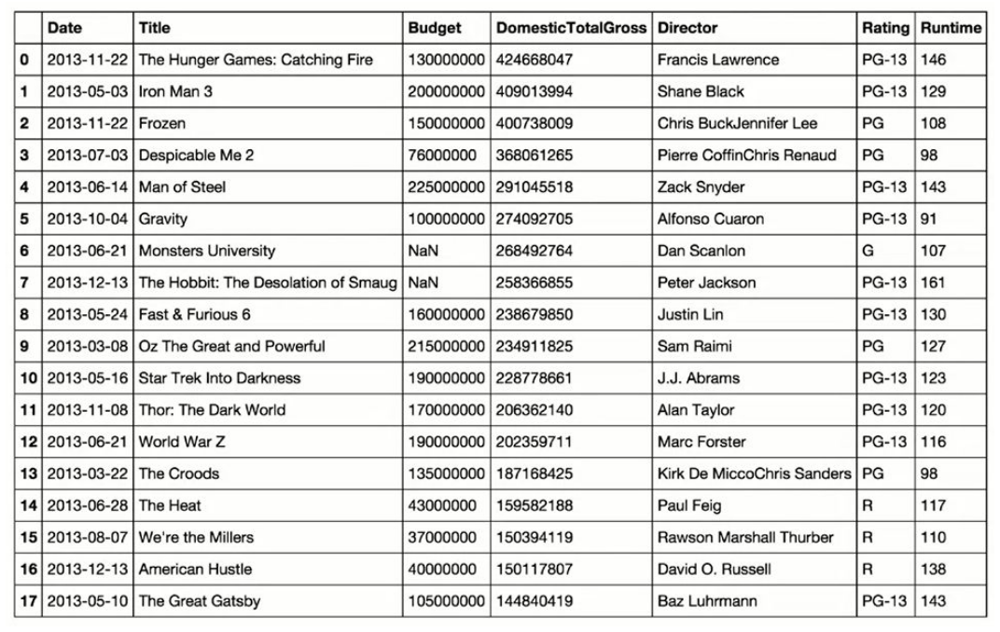
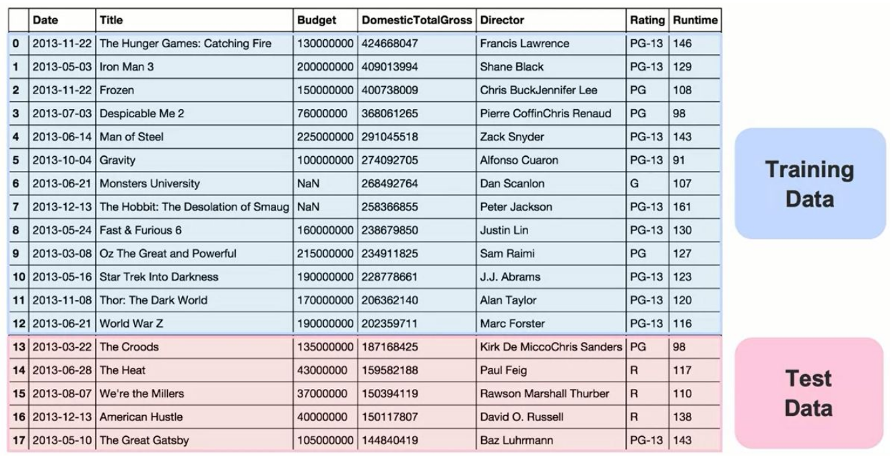
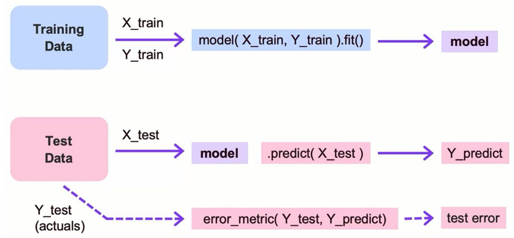
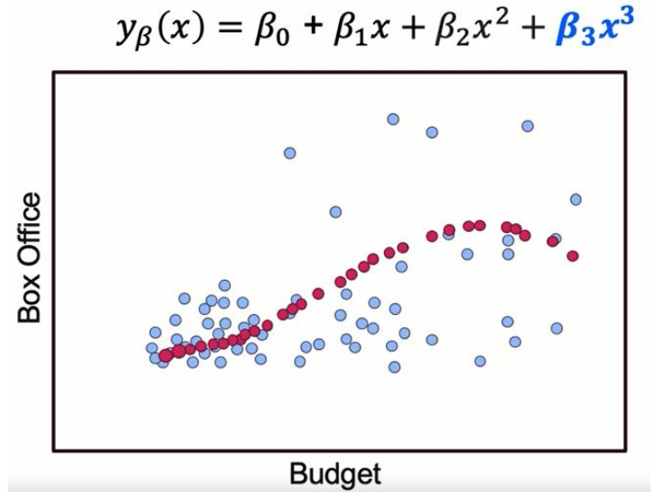

# Machine Learning Notes - Module 2

## Section 1: Training and Test Splits

### Core Concept: Why Split Data?

When working with machine learning models, we face a fundamental challenge: we could theoretically achieve 100% accuracy on our training data by creating an overly specific model. For example, imagine a movie revenue prediction model that memorizes exact patterns:
- Any movie that runs exactly 146 minutes → predicts $424 million
- Any movie that runs exactly 129 minutes → predicts $409 million



**Problem**: This model would fail catastrophically on new, unseen data because it has memorized rather than learned patterns.

### The Solution: Train-Test Split

**Key Principle**: Split your historical dataset into two independent portions:

1. **Training Data**: Used to learn optimal parameters from labeled data
2. **Test Data**: Held out as "unseen" data to evaluate model performance



**Process Flow**:



### Important Concept: Data Leakage

**Critical Warning**: Ensure training and test sets are completely independent. Data leakage occurs when test data information accidentally influences training, invalidating your evaluation.

### Workflow Example: Linear Regression

**Step 1**: Fit model to training data
- Find parameters that best explain training patterns
- The model learns the line of best fit

**Step 2**: Predict on test data
- Use learned parameters to predict test set values
- These predictions appear as points on the learned line

**Step 3**: Measure error
- Calculate distance between actual test values and predictions
- This measures how well the model generalizes to unseen data

---

## Section 2: Implementation Details

### Python Implementation Syntax

**Import Statement**:
```python
from sklearn.model_selection import train_test_split
```

### Basic Train-Test Split

**Simple data split (30% test set)**:
```python
# Split entire dataset
train, test = train_test_split(data, test_size=0.3)
# test_size=0.3 means 30% goes to test set, 70% to training
```

**Splitting features and labels**:
```python
# When you have X (features) and Y (labels)
X_train, X_test, Y_train, Y_test = train_test_split(X, Y, test_size=0.3)

# Returns 4 arrays:
# X_train: training features
# X_test: test features  
# Y_train: training labels
# Y_test: test labels
```

**Note on test_size parameter**:
- Values between 0 and 1: interpreted as percentage
- Values > 1: exact number of samples for test set

### The Complete Workflow

```python
# Step 1: Prepare training data
# X_train = features for training
# Y_train = labels for training

# Step 2: Fit model
model.fit(X_train, Y_train)  # Learn parameters from labeled training data

# Step 3: Make predictions
Y_predict = model.predict(X_test)  # Predict labels for test features

# Step 4: Evaluate
# Compare Y_predict with Y_test to calculate test error
test_error = error_metric(Y_test, Y_predict)
```

### Advanced Splitting Methods

**1. ShuffleSplit**:
- Creates multiple train-test splits
- Can generate various holdout sets (last 30%, middle 30%, random 30%)
- Useful for more robust evaluation

**2. StratifiedShuffleSplit**:
- Maintains class distribution proportions
- **Example**: Medical dataset with cancer diagnosis
  - If 99% negative, 1% positive in full data
  - Ensures both train and test maintain 99:1 ratio
- Critical for imbalanced datasets

---

## Section 3: Polynomial Regression and Model Extension

### Creating Polynomial Features

**Core Concept**: Transform existing features to capture nonlinear relationships while still using linear regression.

**Example Transformation**:
- Original feature: `budget`
- New features: `budget`, `budget²`, `budget³`
- Result: Nonlinear relationship between budget and box office revenue



**Important Note**: The algorithm remains linear regression because the outcome is still a linear combination of features (even though features themselves are nonlinear transformations).

### Types of Feature Engineering

1. **Polynomial Terms**: 
   - Feature squared: `x²`
   - Feature cubed: `x³`
   
2. **Interaction Terms**:
   - Feature multiplication: `feature1 × feature2`
   - Example: `population ÷ households` = households per capita
   - Automatically created by polynomial regression in scikit-learn

### Python Implementation

```python
# Import polynomial features
from sklearn.preprocessing import PolynomialFeatures

# Create instance with degree 2
polyFeat = PolynomialFeatures(degree=2)

# Fit to data and transform
# This learns what transformations to apply
polyFeat.fit(X)

# Transform the data
# Creates: original features, squared features, interaction terms
X_poly = polyFeat.transform(X)

# Combined operation
X_poly = polyFeat.fit_transform(X)
```

**What degree=2 creates**:
- Original features: `x1, x2`
- Squared features: `x1², x2²`
- Interaction term: `x1 × x2`
- Constant term: `1`

### Choosing the Right Functional Form

**Strategies for Feature Selection**:

1. **Theory-Driven Approach**:
   - Start with domain knowledge
   - Create features that make theoretical sense
   
2. **Data-Driven Approach**:
   - Generate all possible combinations (if computationally feasible)
   - Check correlation with outcome variable
   - Use cross-validation to evaluate impact

3. **Feature Selection Process**:
   - Create candidate features
   - Test correlation with outcome
   - Use cross-validation to determine positive/negative effects
   - Select features that improve model performance

### Benefits of Polynomial Features

**1. Better Prediction**:
- More complex models can capture data curvature
- Improved fit on holdout set when appropriate complexity

**2. Better Interpretation**:
- Interaction terms reveal relationship between variables
- Coefficients gain meaningful interpretation
- Example: Population/households ratio provides per capita insights

### The Bias-Variance Trade-off

**Central Challenge**: Finding the right balance between:
- **Underfitting** (high bias): Model too simple, misses patterns
- **Overfitting** (high variance): Model too complex, memorizes noise

**Key Principle**: This framework applies to ALL machine learning models:
- Logistic Regression
- K-Nearest Neighbors  
- Decision Trees
- Support Vector Machines
- Random Forests
- Ensemble Methods
- Deep Learning Approaches

### Model Evaluation Framework

**Universal Process** (applies to all models):

1. **Transform features** to appropriate complexity
2. **Use cross-validation** to evaluate performance
3. **Apply regularization** (covered later) to control complexity
4. **Find optimal balance** between training fit and test generalization

**Remember**: The concepts learned here form the foundation for all advanced machine learning techniques. Every model requires finding the right complexity level to balance underfitting and overfitting.

### Key Takeaway

Polynomial features and interaction terms are preprocessing techniques that allow linear models to capture nonlinear relationships. The resulting model remains linear in its parameters but can model complex, nonlinear patterns in the data. This same framework of balancing complexity and generalization extends to all machine learning algorithms you'll encounter.