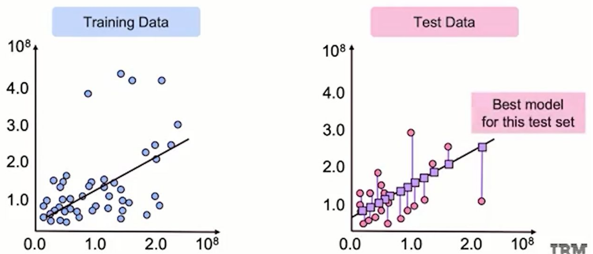
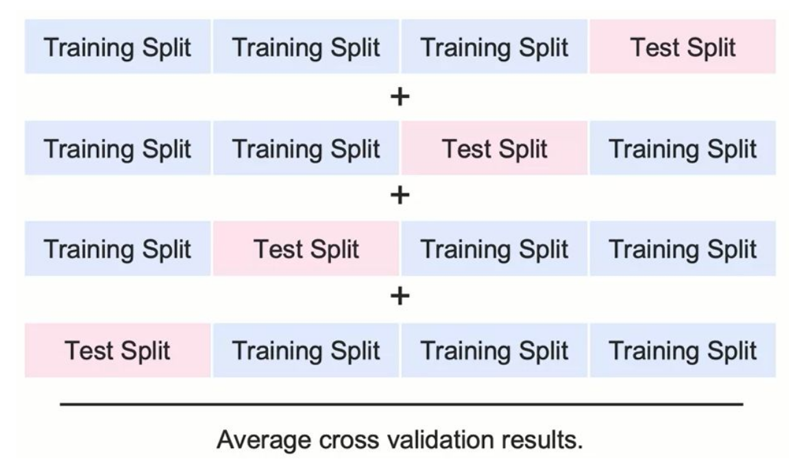
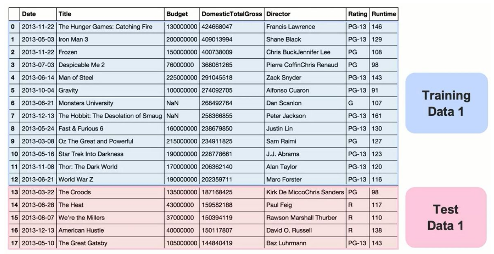
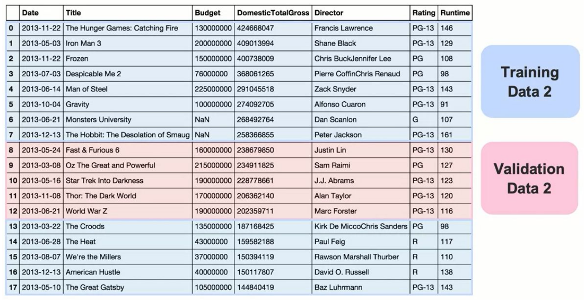
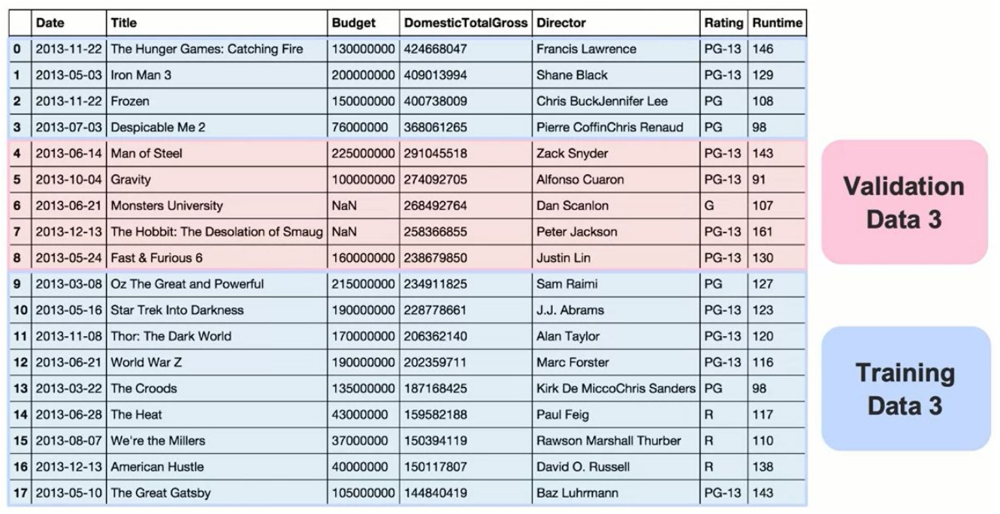
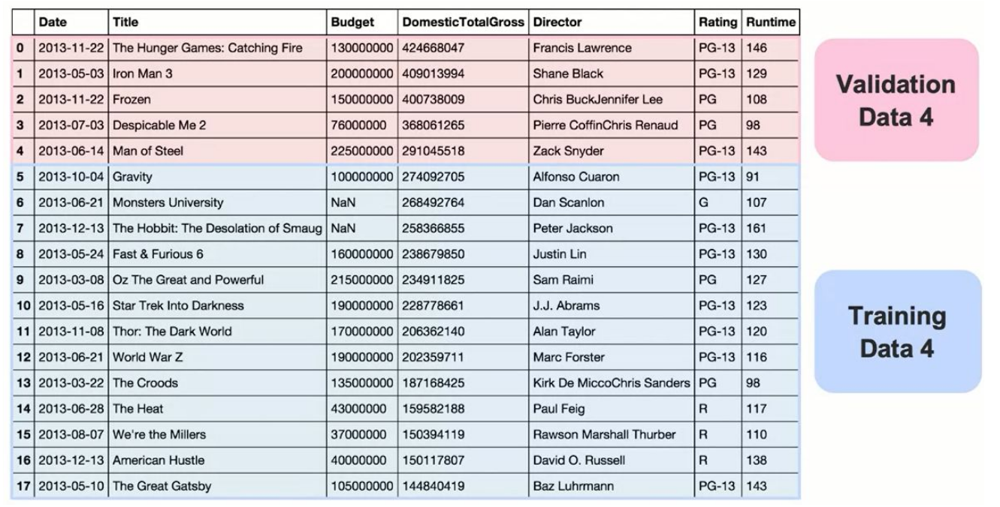
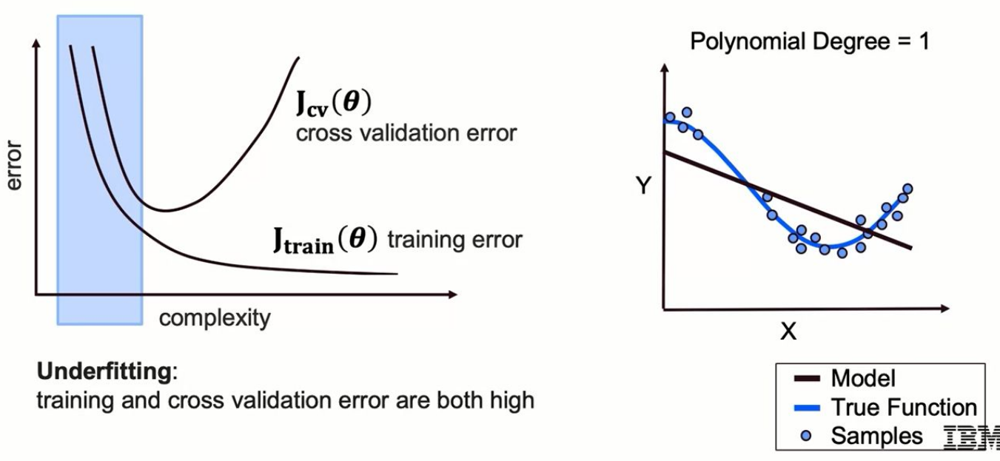
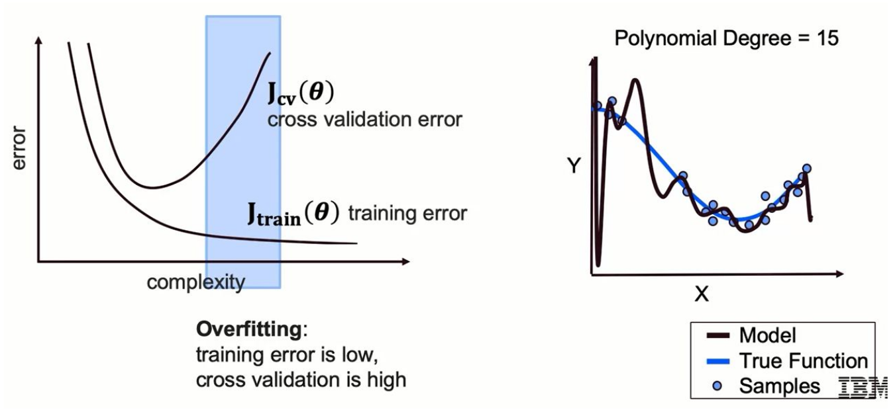
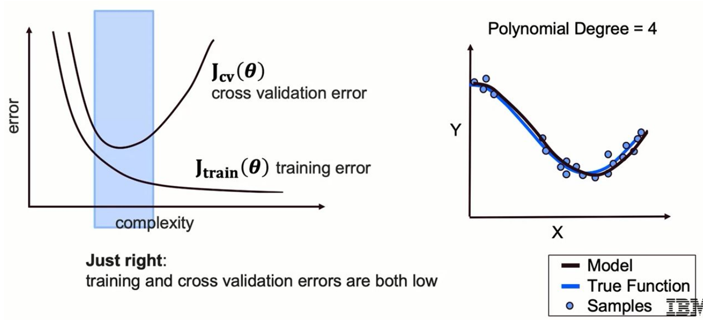

# Machine Learning Notes - Module 3

## 1. Cross-Validation: Moving Beyond Single Test Splits

### Why Cross-Validation is Superior to Single Test Splits

Cross-validation represents a significant improvement over calculating error on just a single test split. While a single train-test split provides one measure of model performance, cross-validation calculates error across multiple train-test splits, providing a more statistically significant performance measure.



**Key Advantages:**
- We may get lucky with our model choice on just one test holdout set
- Cross-validation provides greater confidence in our model by proving strong performance across multiple test sets
- More robust and reliable evaluation of model generalization

### The Cross-Validation Process

The data splitting process involves:
1. Splitting data into multiple pairs of train and test splits (not just one pair)
2. Training the model on each training set
3. Testing on each corresponding test set
4. Averaging the resulting errors from all test sets



**Important Trade-off:** This approach takes more time since we must train across multiple training sets and test across multiple test sets, but the performance measure becomes more statistically significant.

**Formula for Error Calculation:**
- Model parameters are determined by: **$θ = argmin(Loss(Training Data))$**
- Error is calculated on test data: **$Error = Loss(Test Data, θ_best)$**
- Final cross-validation error: **$CVerror = (1/k) × Σ(Error_i)$** where k is the number of folds

## 2. Creating Multiple Train-Test Splits from One Dataset

### The Validation Set Concept

The terminology distinction is important:
- **Test Data:** Generally regarded as data we won't look at until completely done modeling
- **Validation Data:** Used during model selection to figure out what the best model is

### Creating Multiple Non-Overlapping Splits

The process for creating multiple splits from historical data:

1. **First Split:**
   - Training Data 1: Subset of historical data
   - Validation Data 1: Hold-out portion (no overlap with Training Data 1)



2. **Second Split:**
   - Training Data 2: Different subset of historical data
   - Validation Data 2: Must have no overlap with Validation 1 or Training Data 2



3. **Third Split:**
   - Training Data 3: Another different subset
   - Validation Data 3: Mutually exclusive from all other validation sets



4. **Fourth Split (example with 4 folds):**
   - Training Data 4: Final training subset
   - Validation Data 4: Final validation subset with no overlap



**Critical Rule:** All validation sets must be mutually exclusive (independence, no overlap between any validation sets).

## 3. The Complexity-Error Relationship

### Understanding Error Metrics vs Model Complexity

The relationship between model complexity and error follows distinct patterns for training and validation data:

#### Training Error Pattern
- **Observation:** As model complexity increases, training error continuously decreases
- **Mathematical Expression:** Error_train = f(complexity), where f is monotonically decreasing
- **Reason:** Very complex models can achieve perfect or near-perfect accuracy on training data
- **Example:** A polynomial of degree 15 can fit exactly through all training points

#### Cross-Validation Error Pattern
The cross-validation error exhibits three distinct regions:

1. **Underfitting Region (Left side of curve):**
   - Model is not complex enough
   - Both training and cross-validation errors are high
   - **Example:** Using simple linear regression for data with clear curves
   - **Visual:** Think of fitting a straight line through obviously curved data



2. **Overfitting Region (Right side of curve):**
   - Model is too complex
   - Training error is low but cross-validation error increases
   - **Example:** Polynomial degree = 15 fitting exactly to training points
   - **Problem:** Poor generalization to new data (imagine predicting at the far left of x-axis where the overfit model shows huge dips)



3. **"Just Right" Point (Goldilocks Point):**
   - Cross-validation error plateaus at its minimum
   - Both training and cross-validation errors are relatively low
   - **Example:** Polynomial degree = 4 matching well with true underlying function
   - **Goal:** Find where CV error stops decreasing and starts increasing



### Practical Model Selection Strategy

In practice, since we can't visualize the true underlying function:
1. Monitor both training error and cross-validation error as complexity increases
2. Training error will continuously decrease with complexity
3. Cross-validation error will decrease initially, then increase
4. **Decision Rule:** Stop increasing model complexity when cross-validation error starts to increase

## 4. Types of K-Fold Cross-Validation

### 4.1 Standard K-Fold Cross-Validation

**Definition:** Dataset is randomly partitioned into K folds of roughly equal size.

**Process:**
1. Data randomly split into K equal-sized folds
2. For each iteration i (where i = 1 to K):
   - Fold i becomes the validation set
   - Remaining K-1 folds form the training set
3. Each fold serves as validation set exactly once

**Example with K=5:**
- Creates 5 folds
- Model trained 5 times
- Each iteration uses 4 folds for training, 1 for validation
- Every data point appears in validation set exactly once

### 4.2 Leave-One-Out Cross-Validation (LOOCV)

**Definition:** Special case where K = n - 1 (n is number of rows)

**Characteristics:**
- Leave out just a single row for validation
- Train on all remaining rows
- Repeat for each row in dataset

**Advantages:**
- Many more test sets → more evaluations
- Higher certainty about prediction on new data

**Disadvantages:**
- Much longer training time
- Must train n models (one for each row)

### 4.3 Stratified K-Fold Cross-Validation

**Definition:** Maintains representative samples with consistent class distribution across folds.

**Key Feature:** Preserves the proportion of classes in each fold.

**Example:**
- Original dataset: 80% True, 20% False
- Each fold maintains: 80% True, 20% False
- Particularly valuable for imbalanced datasets

**Use Case:** Binary classification with imbalanced data
- If 90% samples are Class A and 10% are Class B
- Each fold preserves this 90-10 ratio
- Ensures unbiased model evaluation

### 4.4 Group K-Fold Cross-Validation

**Purpose:** Used when samples have interdependencies (time-series, spatial correlations).

**Key Principle:** Samples from the same group stay entirely within either training or validation set.

**Example Application:** 
- Multiple time-series sequences from different individuals
- Each sequence (group) remains intact across folds
- Prevents model from learning from future data when making predictions

## 5. Implementation with scikit-learn

### Basic Implementation Code

```python
# Import necessary function
from sklearn.model_selection import cross_val_score

# Basic cross_val_score usage
scores = cross_val_score(
    estimator=model,        # The model to evaluate (e.g., LinearRegression())
    X=X_data,              # Feature data
    y=y_data,              # Target data
    cv=4,                  # Number of folds (K=4 in this case)
    scoring='neg_mean_squared_error'  # Scoring metric (negative for minimization)
)

# Average score across all folds
average_score = scores.mean()
```

### Key Parameters Explained

1. **estimator:** 
   - Can be any model (LinearRegression, polynomial pipeline, etc.)
   - Can include preprocessing steps if using Pipeline

2. **X, y:** 
   - X_data: Feature matrix
   - y_data: Target vector

3. **cv:** 
   - Integer: Number of folds for standard K-fold
   - Can also accept KFold or StratifiedKFold objects for custom splitting

4. **scoring:**
   - Important: We maximize the scoring value
   - For metrics to minimize (like MSE), use negative version
   - 'neg_mean_squared_error' maximizes negative MSE (minimizes MSE)

### Advanced Implementation with Custom Splitters

```python
from sklearn.model_selection import KFold, StratifiedKFold

# Standard K-Fold with custom parameters
kfold = KFold(n_splits=5, shuffle=True, random_state=42)
scores = cross_val_score(model, X, y, cv=kfold, scoring='neg_mean_squared_error')

# Stratified K-Fold for classification
stratified_kfold = StratifiedKFold(n_splits=5, shuffle=True, random_state=42)
scores = cross_val_score(model, X, y, cv=stratified_kfold, scoring='accuracy')
```

## 6. Effects of K Value Selection

### Smaller K (K = 2 or 3)

**Characteristics:**
- Higher variance across folds
- Each iteration trains on smaller portion of dataset
- Model performance fluctuates more depending on specific data subset

**Results:**
- Less stable model estimates
- Higher risk of overfitting to smaller training sets
- Faster computation (fewer iterations)

### Larger K (K = 10 or 20)

**Characteristics:**
- Lower variance across folds
- Each iteration trains on larger portion of dataset (e.g., 90% for K=10)
- Training set nearly equals full dataset in each iteration

**Results:**
- More stable model performance across folds
- Better generalization
- Reduced overfitting (learns from more diverse data)
- Higher computational cost (more iterations)

**Mathematical Insight:**
- With K=10: Train on 90%, test on 10% per iteration
- With K=n (LOOCV): Train on (n-1)/n, test on 1/n per iteration

### Real-World Example: House Price Prediction

Consider predicting house prices with features: square footage, bedrooms, neighborhood.

**With K=10:**
- **Fold 1:** Training data emphasizes large houses with many bedrooms
  - Model learns: size and bedrooms are crucial
  
- **Fold 2:** Training data from diverse neighborhoods
  - Model learns: neighborhood location is crucial
  
This variance across folds demonstrates why averaging across multiple folds provides more robust evaluation.

## 7. Key Takeaways and Best Practices

### Model Selection Strategy
1. Use cross-validation when comparing multiple models (e.g., testing 50 different models)
2. Relying on single train-test split risks selecting model by luck
3. Cross-validation ensures consistent performance across different data subsets

### Finding the Optimal Complexity
1. Start with simple model, gradually increase complexity
2. Monitor both training and validation errors
3. Stop when validation error begins to increase
4. The plateau point in CV error indicates optimal complexity

### Computational Considerations
- Balance between statistical robustness and computational cost
- K=5 or K=10 are common choices (good balance)
- Use stratified K-fold for imbalanced datasets
- Consider LOOCV only for small datasets where maximum data usage is critical

### Important Notes on Terminology
- **Validation set:** Used during model selection and hyperparameter tuning
- **Test set:** Final holdout for unbiased performance evaluation
- **Cross-validation error:** Average of errors across all folds

### Critical Implementation Details
- Always ensure no data leakage between folds
- Use random_state for reproducibility
- Remember to use negative scoring for metrics to minimize
- Consider computational resources when selecting K value