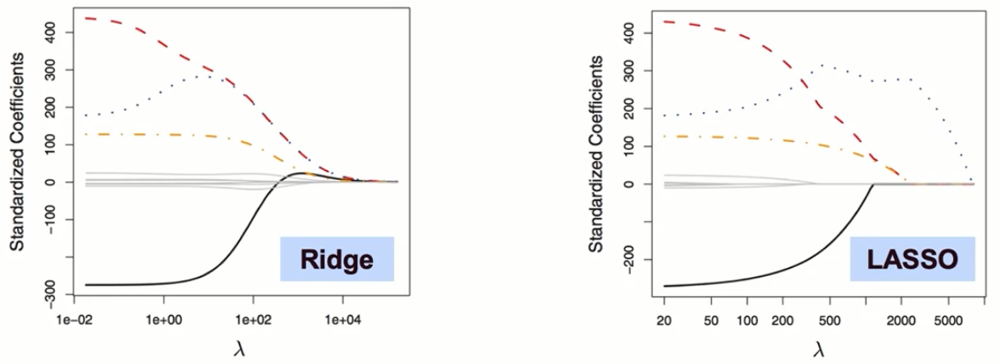
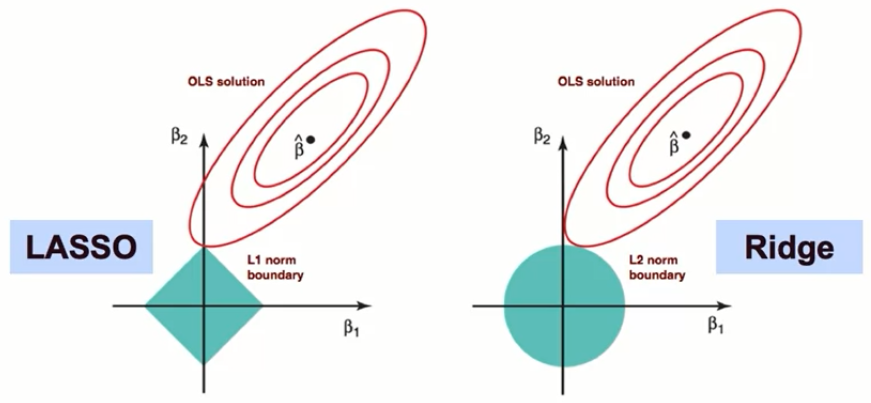
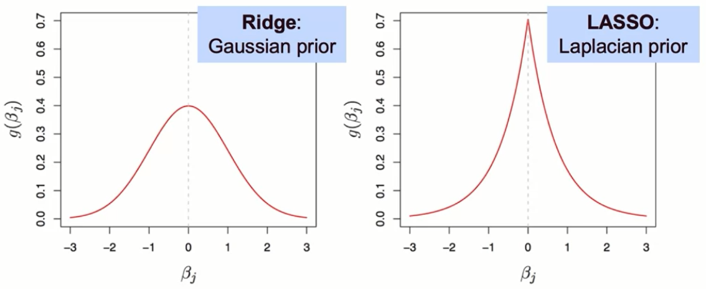

# Machine Learning: Regularization Techniques - Detailed Notes

## Introduction to Regularization

Regularization is a fundamental technique in machine learning that helps us gain deeper intuitive understanding of how to build simpler models while maintaining relatively low error. The goal is to reduce model complexity and avoid overfitting by penalizing high-valued coefficients.

### Core Concept
- **Purpose**: Shed additional light on regularization approaches so they don't seem like a black box
- **Main Goal**: Achieving the goal of reducing complexity while maintaining model performance
- **Key Benefit**: Helps avoid overfitting by shrinking model parameters

## Three Perspectives on Understanding Regularization

### 1. Analytical View

The analytical view presents the obvious mathematical reasoning behind regularization.

#### Key Concepts:
- **L2 and L1 Penalties**: As we incur these penalties, we force coefficients to be smaller, thus restricting their plausible range
- **Smaller Range = Simpler Model**: A smaller range for coefficients must imply a simpler model with lower variance than a model with infinite possible coefficient range



#### Feature Elimination vs Coefficient Shrinking:
1. **Feature Elimination**: 
   - Clear variance reduction
   - Example: The difference between possible solutions for:
     - y as a function of x (simpler)
     - y as a function of x and x² (more complex)

2. **Coefficient Shrinking** (without elimination):
   - Consider how much the y variable changes in response to a feature
   - **Small coefficient (close to zero)**: Feature has almost no effect on outcome
   - **Large coefficient**: Small change in feature → large impact on outcome variable
   - Result: Higher sensitivity = higher variance in the underlying model

### 2. Geometric View

The geometric view helps us understand the optimization problem visually and explains why LASSO zeros out coefficients while Ridge does not.

#### Optimization Problem Formulation:

**Ridge Regression (L2):**
$$
\underset{\beta}{\text{minimize}} \left\{ \sum_{i=1}^{n} \left( y_i - \beta_0 - \sum_{j=1}^{p} \beta_j x_{ij} \right)^2 \right\} \quad \text{subject to} \quad \sum_{j=1}^{p} \beta_j^2 \le s
$$


**LASSO Regression (L1):**
$$
\underset{\beta}{\text{minimize}} \left\{ \sum_{i=1}^{n} \left( y_i - \beta_0 - \sum_{j=1}^{p} \beta_j x_{ij} \right)^2 \right\} \quad \text{subject to} \quad \sum_{j=1}^{p} |\beta_j| \le s
$$

#### Geometric Interpretation:

**Key Insight**: The optimal solution must be found at the intersection of:
1. The penalty boundary (penalty for each coefficient)
2. The contour of the traditional OLS cost function

**Visual Elements:**
- **Red contour lines**: Represent sets of solutions with same error on OLS cost function
- **Center point (β̂)**: Optimal OLS solution without constraints
- **Outer rings**: Each ring represents coefficients producing same squared error
  - Example: Inner ring = error of 10, Second ring = error of 20, etc.



#### Why Solutions Differ:

**For LASSO (Diamond Shape):**
- Constraint region: Diamond shape where Σ|βj| = constant
- Example for 2D (β₁, β₂):
  - Right corner: β₁ = 1, β₂ = 0
  - Top corner: β₁ = 0, β₂ = 1
  - Edge points: Linear combinations (e.g., β₁ = 0.5, β₂ = 0.5)
- **Critical Point**: Intersection typically occurs at corners/edges
- **Result**: Coefficients at corners = some coefficients zeroed out
- This property extends to higher dimensions

**For Ridge (Circle Shape):**
- Constraint region: Circle where Σβj² = constant
- All points on circle equally likely for intersection
- **Result**: Coefficients shrink but don't necessarily become zero
- Intersection can happen at any point on the circle

**Why This Matters:**
- Every point on a contour line has same OLS error
- We choose the point that minimizes regularization term
- The geometry determines whether coefficients zero out (LASSO) or just shrink (Ridge)

### 3. Probabilistic View

The probabilistic view shows how regularization can be understood as imposing prior distributions on regression coefficients from a Bayesian perspective.

#### Bayesian Framework:

**Goal**: Find optimal coefficients given data X and Y

**Bayes Formula Application:**
$$
p(\beta|X, Y) \propto f(Y|X, \beta)p(\beta|X) = f(Y|X, \beta)p(\beta)
$$
$$
p(\beta) = \prod_{j=1}^{p} g(\beta_j)
$$
Where:
- P(β|X,Y) = Posterior probability of coefficients given data
- P(Y|X,β) = Likelihood of data given coefficients
- P(β) = Prior distribution of coefficients

#### Prior Distributions for Different Regularization Types:



**L2/Ridge Regression:**
- **Prior**: Gaussian (Normal) distribution
- **Implication**: Coefficients are drawn from normal distribution centered at zero
- **Effect**: Gradual shrinkage toward zero

**L1/LASSO Regression:**
- **Prior**: Laplacian distribution
- **Characteristic**: Much sharper and higher peak at zero compared to Gaussian
- **Effect**: More likely to zero out coefficients completely

#### Lambda (λ) Parameter Interpretation:

- **Higher λ** = Smaller variance in prior distribution
- **Smaller variance** = Values more concentrated around zero
- **Result**: Higher λ → Smaller coefficients (closer to zero)
- The λ parameter controls how strongly we believe coefficients should be near zero

## Comprehensive Regularization Summary

### Primary Goal
Optimize the bias-variance trade-off to minimize error on unseen data (test set)

### How Regularization Works
1. **Reduces complexity** by penalizing it in the cost function
2. **Lambda (λ) term** adjusts penalty strength to fine-tune complexity reduction
3. **Trade-off**: Increases bias but reduces variance (often worthwhile)

### Key Benefits
- Prevents overfitting
- Creates more generalizable models
- Helps when starting model is too sensitive to small changes
- Achieves better balance between bias and variance

### Options and Validation

**Two Main Types:**
1. **Ridge (L2)**: Shrinks all coefficients proportionally
2. **LASSO (L1)**: Can zero out coefficients (feature selection)

**Model Selection Process:**
- Iterate through different λ values (hyperparameter tuning)
- Use cross-validation to select best model and λ strength
- Compare performance of Ridge vs LASSO for specific problem

### Pros and Cons Comparison

**LASSO Advantages:**
- Feature selection capability
- Added interpretability (fewer non-zero coefficients)
- Clearer understanding of important features

**Ridge Advantages:**
- Penalizes outliers more heavily
- Computationally faster than LASSO
- Better when many features truly affect outcome

**Elastic Net:**
- Hybrid approach combining L1 and L2 penalties
- Additional parameter α determines weight between L1 and L2
- Benefits from both Ridge and LASSO properties

### The Bias-Variance Trade-off Philosophy

**Essential Balance:**
- Model must be **sufficiently complex** to capture true X-Y relationship (not too high bias)
- Model must **not be overly complex** to avoid overfitting to training set (not too high variance)

**Avoiding Extremes:**
- **Too Simple**: High bias, underfitting, misses true patterns
- **Too Complex**: High variance, overfitting, perfect on training but poor on test data
- **Just Right**: Balanced complexity that generalizes well

### Three Interpretative Approaches Recap

1. **Analytical Approach**
   - Mathematical proof that smaller coefficients → less complex models
   - Direct relationship between coefficient magnitude and model sensitivity

2. **Geometric Approach**
   - Visual understanding of constraint regions
   - Explains why LASSO zeros coefficients (diamond corners) vs Ridge (circular boundary)
   - Shows optimization as intersection of cost contours and penalty boundaries

3. **Probabilistic Approach**
   - Bayesian framework with prior distributions
   - Ridge = Gaussian prior, LASSO = Laplacian prior
   - Lambda controls prior variance (belief strength about coefficients being near zero)

## Key Technical Details

### Cost Functions with Regularization

**Ridge Regression Cost Function:**
```
J(β) = Σ(yi - ŷi)² + λΣβj²
```

**LASSO Regression Cost Function:**
```
J(β) = Σ(yi - ŷi)² + λΣ|βj|
```

**Elastic Net Cost Function:**
```
J(β) = Σ(yi - ŷi)² + λ[α·Σ|βj| + (1-α)·Σβj²]
```
Where α ∈ [0,1] controls the mix of L1 and L2 penalties

### Best Practices
1. **Feature Scaling**: Always scale features (e.g., using StandardScaler) so penalties aren't impacted by variable scale
2. **Cross-Validation**: Use k-fold cross-validation to select optimal λ
3. **Model Comparison**: Try both Ridge and LASSO to see which performs better for your specific problem
4. **Consider Elastic Net**: When unsure, Elastic Net provides flexibility between L1 and L2

## Sources of Model Error
1. **Bias**: Error from oversimplifying the problem
2. **Variance**: Error from being too sensitive to training data fluctuations  
3. **Irreducible Error**: Inherent noise in the data that cannot be reduced

Regularization primarily addresses the bias-variance component by allowing us to systematically trade increased bias for reduced variance.

## Conclusion

Regularization is a fundamental concept that will be key throughout the machine learning journey. Every model uses some form of regularization to find the right balance between bias and variance. Understanding regularization from analytical, geometric, and probabilistic perspectives provides deep intuition about why and how these techniques work, moving beyond treating them as black-box methods.

The choice between Ridge, LASSO, or Elastic Net depends on:
- Whether feature selection is desired
- The true underlying relationship complexity
- Computational resources available
- Interpretability requirements

Mastering regularization enables building models that generalize well to unseen data - the ultimate goal of machine learning.