# Machine Learning Course - Module 4

## Part 1: Bias-Variance Tradeoff

### Core Concept: Model Complexity vs. Error

**Key Principle:** When building a model, we want both training and test errors to be as small as possible.

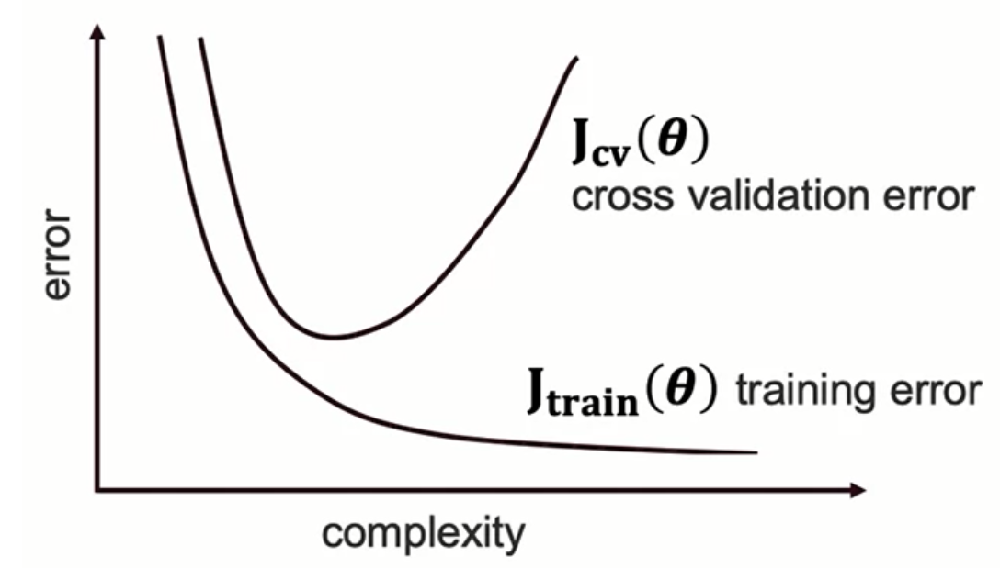

#### The Complexity-Error Relationship
- **Training Error:** Continuously decreases as model complexity increases
- **Test Error:** Initially decreases, reaches minimum, then increases with complexity
- **Optimal Point:** The middle of the curve where both errors are minimized

#### Visual Understanding: Polynomial Regression Example
Three scenarios with polynomial models (degree 1, 4, and 15):

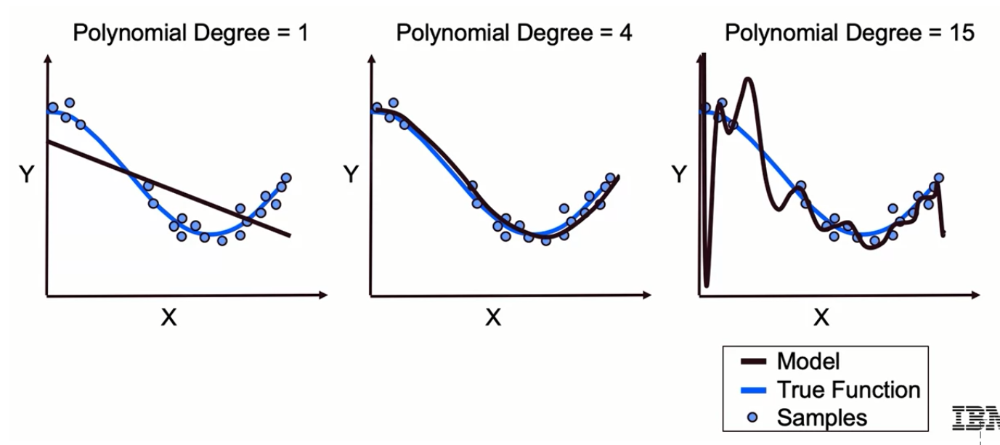

1. **Degree 1 (Too Simple)**
   - High bias, low variance
   - Too rigid to capture curved patterns
   - Poor performance on both training and test sets

2. **Degree 4 (Just Right)**
   - Balanced bias and variance
   - Captures underlying pattern without overfitting
   - Low error on both training and test sets

3. **Degree 15 (Too Complex)**
   - Low bias, high variance
   - Fits training data perfectly but overfits
   - Predictions fluctuate wildly
   - Poor generalization to new data

### Bias and Variance Definitions

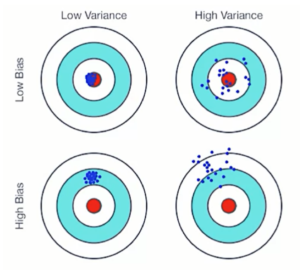

#### Bias
- **Definition:** The tendency of a model to consistently miss the target
- **Characteristics:**
  - Results from overly simplistic models
  - Missing information or relationships
  - Consistent but incorrect predictions
  - Associated with **underfitting**
- **Visual:** High bias = consistent predictions that miss the target (bottom-left quadrant)

#### Variance
- **Definition:** The tendency for predictions to fluctuate dramatically
- **Characteristics:**
  - High sensitivity to small input changes
  - Model instability across different training sets
  - Associated with **overfitting**
  - Captures noise along with signal
- **Visual:** High variance = inconsistent, scattered predictions (top-right quadrant)

### Three Sources of Model Error

1. **Model is Wrong (High Bias)**
   - Fails to identify true relationship between features and outcomes
   - Consistently incorrect predictions
   - Example: Using linear model for non-linear relationship

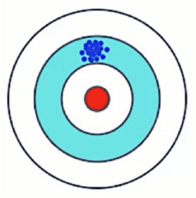

2. **Model is Unstable (High Variance)**
   - Too perfectly identifies relationships
   - Incorporates random noise
   - Predictions vary wildly with slight input changes
   - Example: Polynomial degree 15 fitting to noise

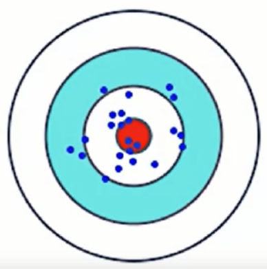

3. **Unavoidable Randomness**
   - Inherent noise in real-world data
   - Cannot be eliminated
   - Sets theoretical limit on model performance
   - All models must accept some level of this error

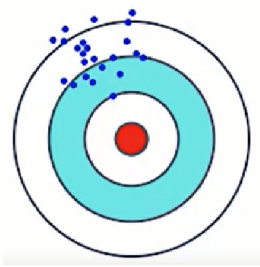

### The Bias-Variance Tradeoff

**Fundamental Principle:** Model adjustments that decrease bias will often increase variance, and vice versa.

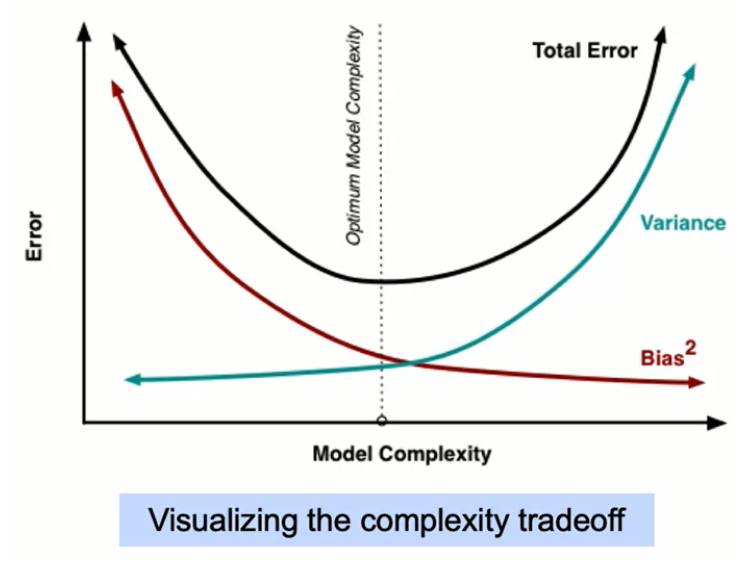

#### Mathematical Decomposition
The Mean Squared Error (MSE) can be decomposed into:
- **MSE = Bias² + Variance + Irreducible Error**

#### Practical Implications
- **High Bias Models:**
  - Simple models (e.g., linear regression for complex relationships)
  - Underfit the data
  - Poor on both training and test sets
  - Consistent but wrong

- **High Variance Models:**
  - Complex models (e.g., high-degree polynomials)
  - Overfit the data
  - Excellent on training, poor on test
  - Inconsistent predictions


#### Finding the Sweet Spot
The goal is to find models that are:
- Elaborate enough to avoid underfitting (low bias)
- Simple enough to avoid overfitting (low variance)
- Capable of describing true feature-target relationships
- Not sensitive to spurious patterns or noise

---

## Part 2: Continuing Bias-Variance Tradeoff

### Relationship to Complexity

#### Bias and Complexity
- **Lower polynomial degree → Higher bias**
- Model too rigid to capture patterns
- Visual signs: Systematic prediction errors

#### Variance and Complexity
- **Higher polynomial degree → Higher variance**
- Model too sensitive to training data
- Visual signs: Wild fluctuations in predictions

### Optimal Model Selection Strategy

**Goal:** Find the right degree of complexity where:
- Model has sufficient flexibility to describe patterns
- Model doesn't overfit to noise
- Balance between bias and variance is optimal

### Key Takeaway on Error Reduction

**Important Insight:** When starting with an extremely overfit model, variance reduction may outpace bias increase.

This means:
- We can reduce complexity while barely affecting bias
- The tradeoff isn't always linear
- Starting from very complex models, initial simplification improves generalization
- Eventually reaches optimal balance point with lowest test error

---

## Part 3: Regularization and Model Selection

### What is Regularization?

**Definition:** A technique to prevent overfitting by adding a penalty term to the cost function that discourages model complexity.

#### The Regularization Cost Function

**Original Cost Function (e.g., Linear Regression):**

$$
\sum_{i=1}^{n} \left( y_i - \beta_0 - \sum_{j=1}^{p} \beta_j x_{ij} \right)^2 + \lambda \sum_{j=1}^{p} \beta_j^2 = \text{RSS} + \lambda \sum_{j=1}^{p} \beta_j^2
$$

**Regularized Cost Function:**
```
Cost = M(w) + λ × R(w)
```

Where:
- `M(w)` = Original cost function (e.g., MSE)
- `λ` (lambda) = Regularization strength parameter (we choose this)
- `R(w)` = Regularization term (function of parameters/weights)

#### How Regularization Works

1. **Penalty for Complexity:** The regularization term `λ × R(w)` penalizes large parameter values
2. **Strength Control:** Lambda controls penalty strength:
   - Higher λ → More penalty → Simpler model → Higher bias, lower variance
   - Lower λ → Less penalty → More complex model → Lower bias, higher variance
3. **Optimization:** Model must balance fitting data vs. keeping parameters small

### Regularization as Feature Selection

**Key Insight:** Regularization performs implicit feature selection by:
- Reducing contribution of less important features
- Driving some coefficients to zero (especially LASSO)
- Eliminating features automatically based on mathematical criteria

#### Benefits of Feature Selection
1. **Reduces overfitting** - Removes noisy/irrelevant features
2. **Improves fitting time** - Fewer features to process
3. **Better interpretability** - Identifies important features
4. **Generalizes better** - Focuses on true relationships

#### Manual Feature Selection Alternative
- Remove features one at a time
- Measure predictive performance via cross-validation
- Keep features that improve holdout set performance

---

## Part 4: Ridge Regression (L2 Regularization)

### The Ridge Cost Function

**Formula:**
```
Cost = RSS + λ × Σ(β_i²)
```

Expanded:
$$
J(\beta_0, \beta_1) = \frac{1}{2m} \sum_{i=1}^{m} \left( (\beta_0 + \beta_1 x_{obs}^{(i)}) - y_{obs}^{(i)} \right)^2 + \lambda \sum_{j=1}^{k} \beta_j^2
$$

Where:
- `RSS` = Residual Sum of Squares (original error)
- `λ` = Regularization parameter (chosen by us)
- `β_i` = Model coefficients/weights
- The penalty is proportional to the **square** of coefficients

### Critical: Feature Scaling Requirement

**Why Scaling Matters for Ridge:**

Consider two variables predicting sales:
- Number of stores: 10,000 - 20,000 range
- Price: $8 - $10 range

Without scaling:
- A 1-unit change in stores = small effect
- A 1-unit ($1) change in price = large effect
- Price coefficient will be much larger
- Ridge will heavily penalize the price coefficient unfairly

**Solution: Standardization**
```
x_scaled = (x - mean(x)) / std(x)
```

This ensures all features are on the same scale before applying Ridge.

### Key Properties of Ridge Regression

1. **Penalty Proportionality:** Penalty ∝ coefficient²
   - Coefficient = 1 → Penalty = 1
   - Coefficient = 2 → Penalty = 4
   - Coefficient = 3 → Penalty = 9
   - Larger coefficients are disproportionately penalized

2. **Shrinkage Effect:**
   - Shrinks coefficients toward zero
   - Never exactly zero (unlike LASSO)
   - All features retained but with reduced impact

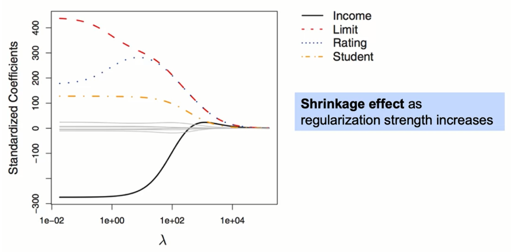

3. **Bias-Variance Impact:**
   - Imposes bias on the model (simpler)
   - Reduces variance (less sensitive)
   - Net effect often improves generalization

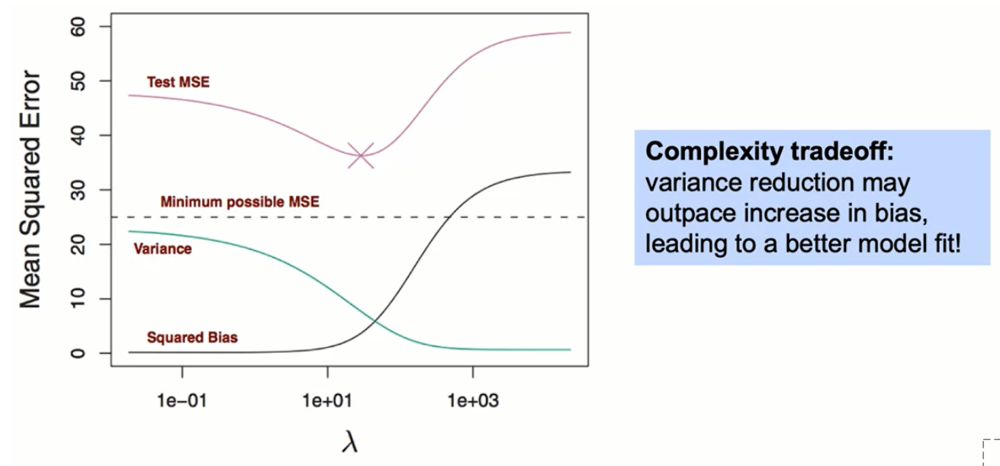

### Selecting Optimal Lambda

**Method:** Cross-validation
1. Try different lambda values
2. Evaluate on holdout sets
3. Choose lambda with best validation performance

### Ridge Coefficient Paths

As lambda increases:
- All coefficients generally decrease toward zero
- Some may temporarily increase due to multicollinearity
- Eventually all decrease monotonically
- Never reach exactly zero

### Practical Example with Polynomial Degree 15

Starting with complex polynomial model:

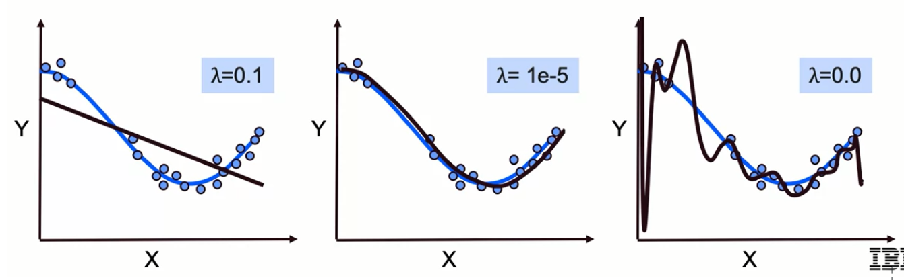

1. **λ = 0.1 (High Regularization)**
   - High bias, underfits
   - Coefficients heavily suppressed
   - Too simple

2. **λ = moderate value**
   - Balanced complexity
   - Good fit to true function
   - Optimal for holdout set

3. **λ = 0 (No Regularization)**
   - Original polynomial 15 model
   - Overfits severely
   - High variance

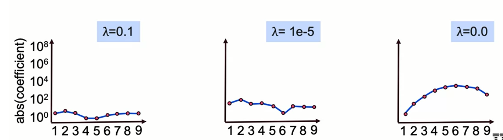

---

## Part 5: LASSO Regression (L1 Regularization)

**LASSO = Least Absolute Shrinkage and Selection Operator**

### The LASSO Cost Function

**Formula:**
```
Cost = RSS + λ × Σ|β_i|
```

Expanded:
```
Cost = Σ(y_i - ŷ_i)² + λ × Σ|β_i|
```

Where:
- The penalty uses **absolute value** instead of square
- This is the L1 norm vs. L2 norm in Ridge

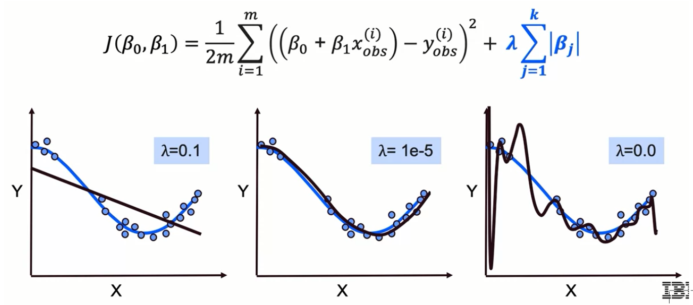

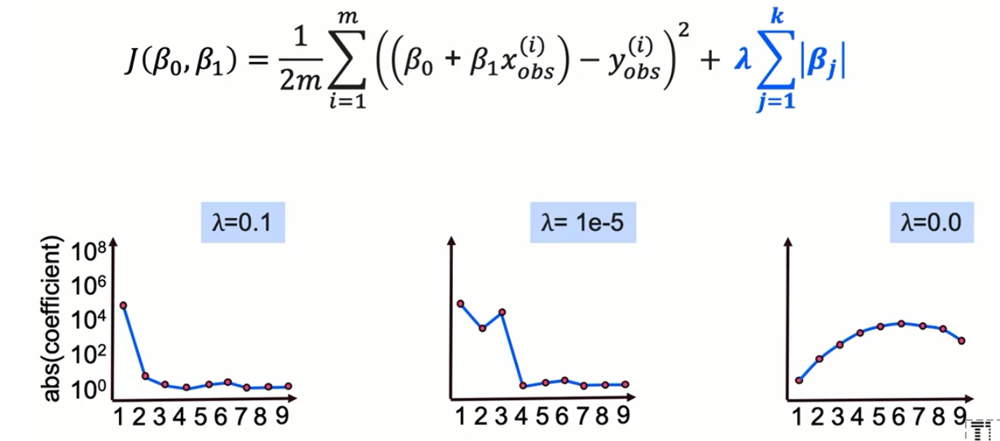

### LASSO vs. Ridge Comparison

**Lasso - L1**
$$
\| \beta \|_1 = \sum |\beta_j|
$$

**Ridge - L2**
$$
\| \beta \|_2 = \sqrt{\sum_{j=1}^{p} \beta_j^2}
$$

| Aspect | Ridge (L2) | LASSO (L1) |
|--------|------------|------------|
| Penalty | β² | \|β\| |
| Outlier sensitivity | High (squares magnify) | Lower (linear penalty) |
| Feature selection | Shrinks all coefficients | Zeros out coefficients |
| Computational speed | Faster convergence | Slower convergence |
| Multicollinearity | Handles well | Can be unstable |

### Key Properties of LASSO

1. **Feature Selection Capability:**
   - Actually eliminates features (coefficients → 0)
   - Automatic identification of important features
   - Improves model interpretability

2. **Selective Shrinkage:**
   - Shrinks coefficients selectively
   - Some go to zero quickly
   - Others may remain relatively large

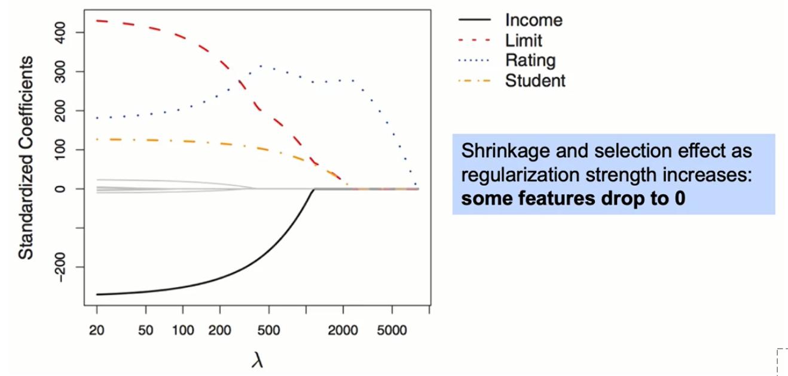

3. **Computational Considerations:**
   - Slower to converge than Ridge
   - Due to non-differentiability at zero
   - Trade-off: speed vs. interpretability

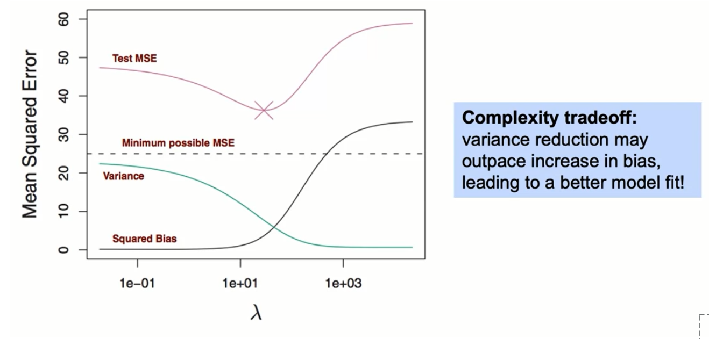

### LASSO Coefficient Paths

As lambda increases:
- Many coefficients quickly go to zero
- Some may increase temporarily (multicollinearity)
- Eventually all decrease
- Many reach exactly zero (unlike Ridge)

### Example Results

With appropriate lambda:
- Can eliminate ~2/3 of features
- Keeps only most predictive features
- Creates sparse, interpretable models

### Choosing Between Ridge and LASSO

**Use Ridge when:**
- Prediction accuracy is primary goal
- Computational efficiency matters
- You want to penalize large weights heavily
- Many features are somewhat relevant

**Use LASSO when:**
- Interpretability is crucial
- You suspect many irrelevant features
- Feature selection is desired
- Sparse models preferred

**Important Caveat:** Model may truly depend on many features - be cautious about eliminating too many.

---

## Part 6: Elastic Net (Hybrid Approach)

### The Elastic Net Cost Function

**Formula:**
```
Cost = RSS + λ × [α × Σ|β_i| + (1-α) × Σ(β_i²)]
```

Alternative notation:
```
Cost = RSS + λ₁ × Σ|β_i| + λ₂ × Σ(β_i²)
```

Where:
- `λ` = Overall regularization strength
- `α` = Mixing parameter (0 to 1)
  - α = 1 → Pure LASSO
  - α = 0 → Pure Ridge
  - 0 < α < 1 → Hybrid
- `λ₁, λ₂` = Separate penalties for L1 and L2

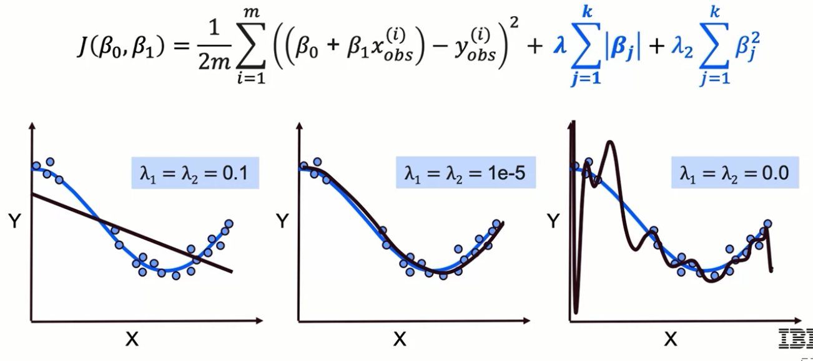

### Benefits of Elastic Net

**Best of Both Worlds:**
- Feature selection from LASSO
- Stability and grouping from Ridge
- Handles multicollinearity better than pure LASSO
- More flexible than either alone

### Hyperparameter Tuning

**Two parameters to optimize:**
1. **Lambda (λ):** Overall penalty strength
2. **Alpha (α):** Balance between L1 and L2

**Optimization Method:** Cross-validation
- Grid search over lambda and alpha values
- Find combination with best holdout performance

### When to Use Elastic Net

- When unsure between Ridge and LASSO
- High multicollinearity with need for feature selection
- Want both shrinkage and selection
- Large number of features with grouped predictors

### Effects of Different Alpha Values

- **Higher α (toward 1):** More LASSO-like
  - More feature elimination
  - Sparser models
  - Better interpretability

- **Lower α (toward 0):** More Ridge-like
  - All features retained
  - Better for correlated features
  - More stable coefficients

---

## Part 7: Recursive Feature Elimination (RFE)

### What is RFE?

**Definition:** An automatic, iterative method for feature selection that recursively removes less important features.

### How RFE Works

1. **Choose a Model:** Select base model (must have coefficients or feature_importances attribute)
2. **Set Target Features:** Define how many features to keep
3. **Iterative Process:**
   - Train model on all features
   - Rank features by importance
   - Remove least important feature(s)
   - Repeat until target number reached

### Implementation in Sklearn

#### Basic RFE

```python
# Import the RFE class
from sklearn.feature_selection import RFE

# Initialize with model and number of features to select
rfeMod = RFE(estimator=est,    # Your model (e.g., LinearRegression)
             n_features_to_select=n_features)  # How many to keep

# Fit on training data
rfeMod.fit(X_train, y_train)

# Predict with selected features
predictions = rfeMod.predict(X_test)
```

#### Requirements for the Estimator
The model (`est`) must have either:
- `.coef_` attribute (linear models)
- `.feature_importances_` attribute (tree-based models)

#### RFECV - RFE with Cross-Validation

```python
from sklearn.feature_selection import RFECV

# RFECV automatically finds optimal number of features
rfecv = RFECV(estimator=est,
              cv=5)  # Number of CV folds

# Fits and selects optimal feature count
rfecv.fit(X_train, y_train)
```

**RFECV Advantages:**
- Automatically determines optimal feature count
- Uses cross-validation for robust selection
- Monitors holdout performance during elimination

### Important Considerations for RFE

1. **Scale Your Data First!**
   - Essential for coefficient-based selection
   - Ensures fair comparison between features
   - Use StandardScaler or similar

2. **Model Choice Matters:**
   - Linear models: Uses coefficient magnitude
   - Tree models: Uses feature importance
   - Different models may select different features

3. **Elimination Strategy:**
   - Removes features with smallest importance
   - Can remove one or multiple per iteration
   - Trade-off: accuracy vs. computation time

### Compatible Models

**Linear Models:**
- LinearRegression
- Ridge
- LASSO
- Logistic Regression

**Tree-Based Models:**
- Random Forest
- Gradient Boosting
- Decision Trees

**Any model with:**
- `.coef_` attribute
- `.feature_importances_` attribute

---

## Summary: Complete Decision Framework

### Model Selection Strategy

#### 1. Assess Your Goals
- **Prediction accuracy** → Use validation/cross-validation
- **Interpretability** → Favor LASSO or RFE
- **Computational efficiency** → Favor Ridge
- **Feature understanding** → Use LASSO or Elastic Net

#### 2. Choose Regularization Method

**Ridge Regression:**
- When: All features likely relevant
- Goal: Reduce coefficient magnitude
- Result: Stable predictions, all features retained

**LASSO Regression:**
- When: Many irrelevant features suspected
- Goal: Feature selection + regularization
- Result: Sparse, interpretable models

**Elastic Net:**
- When: Unsure between Ridge and LASSO
- Goal: Balance between selection and shrinkage
- Result: Flexible hybrid approach

**RFE:**
- When: Need automatic feature selection
- Goal: Systematically reduce features
- Result: Optimal feature subset

#### 3. Optimize Hyperparameters

**Always use cross-validation to find:**
- Optimal λ (lambda) for regularization strength
- Optimal α (alpha) for Elastic Net mixing
- Optimal number of features for RFE

### Key Formulas Reference

**Ridge (L2):**
```
Cost = Σ(y_i - ŷ_i)² + λ × Σ(β_i²)
```

**LASSO (L1):**
```
Cost = Σ(y_i - ŷ_i)² + λ × Σ|β_i|
```

**Elastic Net:**
```
Cost = Σ(y_i - ŷ_i)² + λ × [α × Σ|β_i| + (1-α) × Σ(β_i²)]
```

### Critical Reminders

1. **Always scale features** before regularization
2. **Use cross-validation** for hyperparameter selection
3. **Monitor both training and test errors**
4. **Consider computational constraints**
5. **Balance interpretability with performance**
6. **Remember: Some error is unavoidable** (irreducible noise)

### The Ultimate Goal

Find the model that:
- Generalizes well to new data
- Balances bias and variance optimally
- Meets your specific requirements (accuracy/interpretability/speed)
- Avoids both underfitting and overfitting